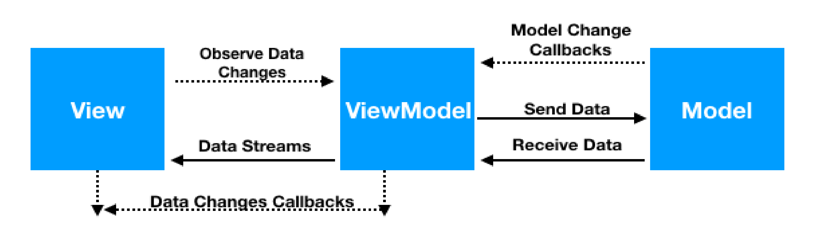
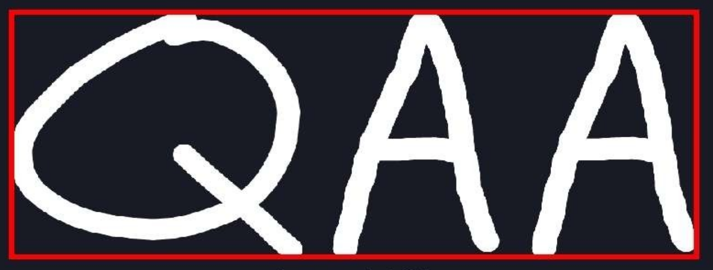
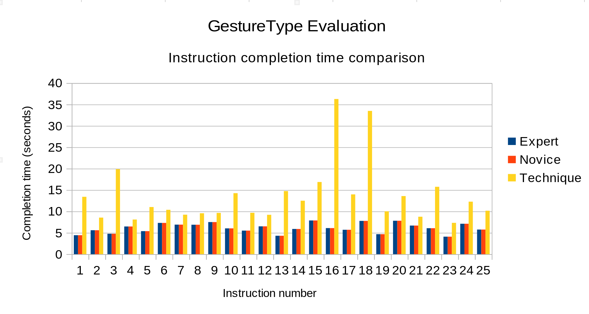
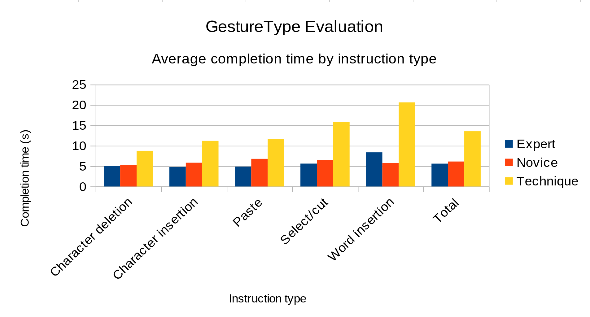
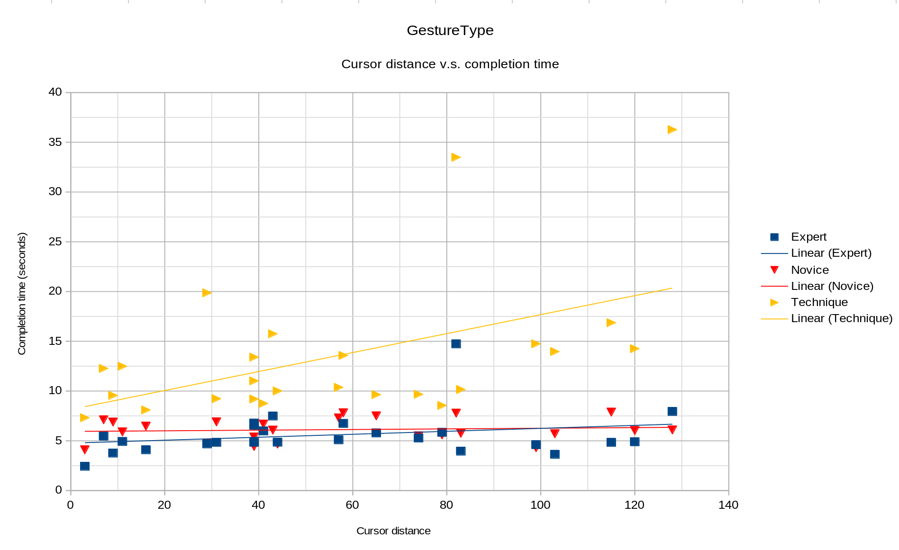

## GestureType – *A Gesture-based Input Device Application*

### I. Interaction Problem

This project addresses the challenge of optimizing text input and command execution, particularly for
users who encounter difficulties with traditional keyboard-based methods. Whether due to physical
constraints, lack of technical proficiency, or individual preferences, typing may be impractical for certain
user groups. The objective of this project is to develop and explore a user-friendly alternative to text input
and text-related functionality that accommodates a diverse range of users.

### II. Interaction Technique

The interaction technique explored in this project entails using an external touchscreen device as an
alternative input method for devices that support the HID keyboard protocol (*section VI.1*). Rather than
typing on a physical keyboard to provide input to one of these devices, users can draw the equivalent
letters, numbers, and symbols directly on the screen of the touch enabled device.

The interaction technique uses a state system that can be in one of two modes. Insert mode is used for text
entry, while command mode is used for executing a set of basic text related commands (*figure A*). In
insert mode, users can insert and delete characters at the position of the text cursor of the connected host
device. Command mode allows users to perform various touch gestures to control the cursor and execute
commands such as selecting, copying, cutting, and pasting text. This approach provides a natural and
user-friendly way to interact with devices that require keyboard input, catering to diverse user needs and
preferences.

*Figure A. Table of the full functionality supported by the interaction technique*

| Touch input | Function |
|----------|----------|
| Double tap | Toggle between insert and command mode |
| Insert mode |
| Draw alphanumeric character or symbol| Insert equivalent ASCII character/symbol at cursor |
| One finger swipe left | Delete character/symbol at cursor |
| One finger swipe right | Insert space at cursor |
| Two finger swipe left | Insert comma at cursor |
| Two finger swipe right | Insert period at cursor |
| Command mode |
| Modifier* + one finger swipe left/right | Move cursor one character left/right |
| Modifier* + two finger swipe left/right | Move cursor one word left/right |
| Modifier* + draw ‘S’ + one finger swipe left/right | Select character to left/right at cursor |
| Modifier* + draw ‘S’ + two finger swipe left/right | Select word to left/right at cursor |
| Draw ‘C’ | Copy selection |
| Draw ‘X’ | Cut/delete selection |
| Modifier* + Draw ‘V’ | Paste selection at cursor |

\**Repetition modifier: Optionally draw a number 1 – 9 and execute the command this many times. If the repetition
modifier is not specified, the command will execute once.*

### III. Technical Overview

#### Architecture

As the project’s interaction technique requires a touch based interface to function, it is implemented in the
form of an Android application for mobile devices. This choice of platforms supports a wide range of
devices, increasing the accessibility of the application and its interaction technique. The application itself
is implemented in Kotlin, a high-level Java-like programming language considered to be the modern
standard for native Android development (*section VI.2*).

The GestureType application uses the model-view-view-model (MVVM) design pattern (*figure B*). As
seen in the model-view-controller pattern (MVC), MVVM shares two of its core components, the model
and view. The model consists of the data and business logic necessary to the function of an application. In
the case of the project application, the model is comprised of the optical character recognition (OCR)
client, the input processing layer, and the Bluetooth client. The view represents the user interface or any
visual user-facing elements, and reflects the current state of the model and view-model. The application’s
user interface is built using Android’s Jetpack Compose toolkit, which provides a flexible and intuitive
way to build modern mobile interfaces (*section VI.3*) Unlike MVC, the MVVM design pattern features a
view-model, which as its name suggests, serves as bridge between the view and model. This component is
primarily responsible for data binding and view state management, and can be closely compared to the
concept of an interaction-model or *i-model* that is present in many MVC-derived design patterns.

*Figure B. Visual representation of the MVVM design pattern*

#### OCR and pre-processing

The primary function of the GestureType application lies in its ability to recognize handwritten
characters, numbers, and symbols. To enable this functionality, the application leverages Google’s ML Kit
text recognition v2 API (*section VI.4*), providing a convenient implementation of basic OCR capabilities.
Despite this convenience, issues arose in early production regarding the accuracy and consistency of
character recognition. The text recognition v2 API is primarily used to detect text in real-world images where 
there are many non-text elements in the environment. It excels in particular at detecting sequences
of characters, such as words and sentences. For this reason, ambiguously shaped characters such as ‘I’,
‘O’, and many others may be difficult to detect when they are not part of a sequence, as they could be
mistaken for a non-text element in the environment.

When a user draws a character in the GestureType application, the pixels of the drawn strokes are saved
onto an initially blank bitmap that is sent to the OCR client for additional processing. This bitmap is
cropped, scaled and appended to a static bitmap depicting the characters ‘AA’ (*figure C*). The combined
bitmap is then parsed by the OCR, and only the first character of the returned string is used. This processing
technique provides context for the drawn character and addresses the previously mentioned issue through the
creation of a bitmap containing a sequence of characters. Since its implementation later on in production, the
accuracy and reliability of interpreted characters has dramatically improved, though there are still issues with
reliably interpreting lower case letters and symbols.

*Figure C. Visual example of a combined bitmap provided the drawn input 'Q'*

#### State machine

Once drawn input is processed by the OCR client or a user performs a gesture, the output of these actions
is provided to the state machine for interpretation. As mentioned earlier, the interaction technique is state
based, operating in either insert mode or command mode. The state machine contains the logic that
determines the functional flow of the application given an input and the current mode, and prepares the
input to be translated into meaningful data that will eventually be interpreted by the HID keyboard
protocol  (*section VI.1* ).

In insert mode, the state machine processes basic text inputs such as adding and deleting characters or
inserting punctuation based on gestures. Command mode allows for more complex operations such as text
selection, copying, cutting, pasting, and moving the cursor. An important aspect of the state machine lies
in the character to key-code map. This a comprehensive mapping from character inputs to Android
KeyEvent codes and shift-key states, which is necessary in preparing the input for the HID keyboard
protocol.

#### Bluetooth and HID emulation

In order to communicate with the host device that should be receiving the input of a user, the GestureType
application leverages Bluetooth connectivity and emulates a Bluetooth keyboard. The layer enabling this
functionality is comprised of the Bluetooth client, keyboard report object, and transmission client, which
in combination, extend the functionality of an Android device to act as a human interface device (HID).

The Bluetooth client establishes and manages Bluetooth connectivity, allowing the Android device to scan
for and connect to available devices. It is also responsible for initializing the HID device profile. This is
accomplished using the Android BluetoothHidDevice API with the keyboard HID descriptor (*section
VI.6*), which defines an input device’s capabilities to the host and is essential for the device to be
recognized and function as a Bluetooth keyboard.

The keyboard report object consists of a byte array that represents the current state of the ‘keyboard’,
such as which keys are pressed and the status of key modifiers like the control and shift keys. Like the
state machine, it also uses a mapping system, translating Android key events into HID compatible key
codes that can be interpreted by the host device.

Lastly, the transmission client functions an intermediary that communicates directly with the Bluetooth
client to send the prepared key reports. It receives input from the state machine, and ensures the input is
processed and transmitted correctly.

### IV. Evaluation

#### Overview

To evaluate the GestureType interaction technique, it is compared to two use cases of a standard
keyboard setup. The first use case replicates expert keyboard usage through key-shortcuts to
execute text commands. For example, moving the cursor to the next word can be accomplished with a
two-finger swipe using the interaction technique, which is equivalent to pressing the right
arrow key modified by the control key in expert usage (*figure D*). The second version replicates novice
keyboard usage. Using the previous example, the equivalent function for this method is using the mouse
to reposition the cursor to the next word.

*Figure D. Supported GestureType cursor commands and their equivalent keyboard methods*

| Command | Expert method | Novice method |
| ----- | ----- | ----- |
| Move cursor one character left/right | Left/right arrow key | Move to character position with mouse |
| Move cursor one word left/right | Ctrl + left/right arrow key | Move to word position with mouse |
| Select character to left/right at cursor | Shift + left/right arrow key | Select character with mouse |
| Select word to left/right at cursor | Ctrl + shift + left/right arrow key | Select word with mouse |
| Copy selection | Ctrl + C key | Right click + select ‘copy’ from menu |
| Cut/delete selection | Ctrl + X key | Right click + select ‘cut’ from menu |
|Paste selection at cursor | Ctrl + V key | Right click + select ‘paste’ from menu |

It is important to note that prior to completing the evaluation, there were no expectations that the
GestureType interaction technique would outperform the keyboard methods. With enough proficiency, it
is not uncommon for one’s keyboard typing speed to surpass their handwriting speed. Given this, it would
be unreasonable to assume that a writing based interaction technique such the GestureType interaction
technique would be an exception. The goal of this is evaluation is to explore the challenges and
opportunities of the interaction technique, even if the analysis realistically reduces to focusing on the
lengths to which it under performs in comparison to the keyboard methods.

#### Setup

To compare the performance of the three methods, each method is used to perform a series of text entry
and modification tasks (referred to as instructions) on a block of text. The same text is used for each
method, along with the same set of 25 instructions presented in the same order. Each instruction consists
of a task whose operation can be classified as one of word insertion, character insertion, character
deletion, select and cut, or paste. Upon the completion of a prompted instruction, the instruction
completion time is automatically recorded. To compare the cursor manipulation functions of each method,
the number of characters places between the text locations that are modified from instruction to
instruction (where the cursor is positioned after completing an instruction, and where it needs to move to
to complete the next instruction) are prerecorded and will be considered in the analysis. The system
enabling the evaluation functionality is built with a simple Tkinter Python application, and is available in
the project repository.

For the keyboard methods, the function required to complete a given instruction is limited to that in the
table of commands depicted in *figure D*. For example, the expert method is strictly limited to using the
arrow keys for cursor manipulation. As a side note regarding this example, only the left and right arrow
keys were are used to manipulate the cursor. This was done in attempt to make this functionality
comparable to the interaction technique, which does not support vertical cursor manipulation.

#### Results

To little surprise, the GestureType interaction technique falls significantly short of the keyboard methods
in overall performance. As depicted in *figure E* and *figure F*, the instruction completion times achieved
with the interaction technique generally range between two to three times the duration of those achieved
with the keyboard counterparts. Word entry instructions see the largest increase in completion time at
approximately four times that of the keyboard methods. Select and cut instructions follow closely at three
times the completion time. This can be attributed to the overhead required to execute these commands.
Consider the case of cutting five words using the interaction technique. First and foremost, this requires
the user to count the number of words in the string they want to cut, assuming this is not obvious at a
glance. After drawing the number to register the modifier, they must draw an ‘S’, then two finger swipe to
select the words. The keyboard methods require fewer, or less complex steps to accomplish the same
action. As for the remaining instruction types, all of those using the interaction technique take the
approximately twice the time to complete as the keyboard methods.

*Figure E. Line chart of the instruction completion times*

The interaction technique’s relatively poor performance in instruction completion time can be attributed
to many factors. Firstly, and as mentioned in an earlier section, proficient keyboard users are generally
able to type faster than they write. This is likely the most significant factor affecting the technique’s
performance, especially considering that inputs are processed on a character by character basis and not in
the form of whole words. The input processing mechanism itself is also a limiting factor and manifests in
two ways. Firstly, there is noticeable input delay resulting from input processing in the back-end. While
this has not been measured or thoroughly investigated, it likely the result of the OCR functionality, the
Bluetooth connection, or a combination of both. The application also uses a timer mechanism to register
the input of the user. It is not until three-hundred milliseconds after the last stroke drawn by the user that
their input begins to be processed. This means that while inserting characters, there is a fixed delay
between each input, which quickly accumulates with the length of the word or sentence that is inputted.
Finally, the application’s OCR capabilities are at fault for the last factor significantly affecting instruction
completion time. Despite the benefit of the additional pre-processing discussed in the technical overview,
it is still possible for the OCR client to misinterpret the character drawn by user. This can generally be
abated by minding one’s input to ensure it is drawn clearly, though this in itself can slow down input time
due to the extra drawing precision required.

*Figure F. Line chart of the average instruction completion times by instruction type*

Due to the limited functionality of the evaluation program, the cursor manipulation commands of all three
input methods could not be directly compared alongside the five groups used to classify the different
instruction types. As described in the evaluation setup, the number of character places required to move
the cursor to the edit location of the succeeding instruction is prerecorded for each instruction. This was
done in attempt to quantify the varying effort required to reposition the cursor with the expectation that
the effectiveness of cursor manipulation functionality would vary across the different input methods. As
seen in *figure G* , this generally does not appear to the case.

Considering the keyboard input methods first, the cursor distance not does not appear to affect the time
taken to complete an instruction, as evident in the flat trend lines depicted in the plot. In the case of the
novice keyboard technique, this is expected due to the fact that all cursor manipulation is done with a
mouse. Unlike the other methods where cursor movement is limited to moving backwards or forwards
through each word or character, the use of a mouse allows free manipulation of the cursor. Despite its
limitation, the expert keyboard method performed on par with its counter part. This is likely due the
ability to quickly move and correct the position the cursor word by word with the press of a button.

The results of the interaction are notably more variable compared to the keyboard methods. Despite the
clear upward trend line in *figure G* , the relationship between the instruction completion time and cursor
distance is likely as not as strong as it appears due to the outlier data points in the sample. Despite this, it
still appears as if there is an upward trend in the scatter plot. This aligns with the subjective experience of

using the cursor manipulation commands in the evaluation. Due the input delay present in the application,
it is common to misplace the cursor from the intended target using quick repeated swipes, especially
when travelling longer distances. The alternative approach to moving the cursor quickly is with the
addition of a modifier. However, as previously mentioned, this requires counting the number of words to
move the cursor, or at the very least, requires the extra input to set the modifier.

*Figure G. Scatter plot of the relationship between the cursor distance and instruction completion time*

### V. Conclusion

This interaction should not be used in place of a keyboard by anyone unless they are blind or missing
everything but a pinky finger. In the case of blindness, its possible that the interaction technique may have
a use case due to its reliance on gestures and touch input. Assuming the system is modified to provide
auditory feedback after an input, its possible that the visually impaired could use the technique for simple,
continuous text input, though its cursor manipulation commands would be of no benefit. In the case of
missing fingers, the utility of the interaction increases with the number of digits missing, unless
that number is ten, in which it has no utility whatsoever. Even in the case that an individual is left with a single
finger, they are probably still better off using using a keyboard, though they may have issues using
command shortcuts and inserting characters that require a modifier key. Until humanity has the
technology to reliably edit and manipulate text using nothing but an individual’s thoughts and neural
impulses, system designers and researchers should consider the data gathered in this analysis as
irrefutable testament to the fact that the keyboard will not replaced any time soon, and they should abandon their
future aspirations to design a system similar to GestureType.

### VI. References and Documentation

1. [HID protocol](https://wiki.osdev.org/USB_Human_Interface_Devices)
2. [Kotlin](https://kotlinlang.org/docs/android-overview.html)
3. [Android Jetpack Compose](https://developer.android.com/develop/ui/compose)
4. [Google ML Kit text recognition v2](https://developers.google.com/ml-kit/vision/text-recognition/v2/android)
5. [Android Bluetooth](https://developer.android.com/develop/connectivity/bluetooth)
6. [HID descriptors](https://docs.kernel.org/hid/hidintro.html)
